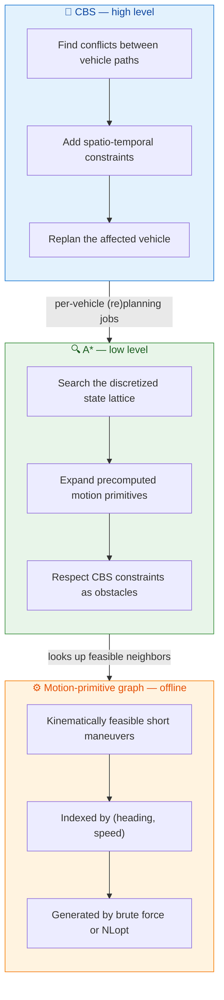

# NH-ICBS-HLC

A **multi-agent motion planner for non-holonomic vehicles** based on **Conflict-Based Search (CBS)**.
The planner combines a high-level CBS layer that resolves conflicts between vehicles with a
low-level A\* search that operates over a **precomputed lattice of motion primitives**, so that
every edge expanded during search is already a kinematically feasible vehicle maneuver.

This was developed as part of my master's thesis. The name stands for
**N**on-**H**olonomic **I**mproved **C**onflict-**B**ased **S**earch **H**igh-**L**evel **C**ontroller.

---

## Demo

Two multi-vehicle scenarios planned by the CBS layer, rendered from the planner's JSON output.

https://github.com/David1234500/NH-ICBS-HLC/raw/master/docs/Demo1.mp4

https://github.com/David1234500/NH-ICBS-HLC/raw/master/docs/Demo2.mp4

> If the players don't load inline, download them directly:
> [Demo 1](docs/Demo1.mp4) · [Demo 2](docs/Demo2.mp4).

📊 For the full background, method, and results, see the final thesis presentation:
[**Abschlussvortrag David Klüner.pptx**](docs/Abschlussvortrag%20David%20Kl%C3%BCner.pptx).

---

## How it works

The planner is built from three layers that fit together as follows:



### 1. Motion primitives (offline, computed once)

The continuous vehicle state is discretized into a 4D index `(x, y, a, s)`:

- `x`, `y` — grid cell on the map (`disc.dstep` cm per cell),
- `a` — heading bucket (`disc.hstep` rad per bucket, `map.angle_steps` total),
- `s` — discrete speed level (`velocity.vlevels`).

A **motion primitive** is a short, two-step maneuver (each step lasting `timestep_ms`) that connects
one discrete state to a nearby reachable one, generated using a single-track (bicycle) kinematic model
(`SimpleDynamicsModel`). Primitives are computed once and stored as a graph on disk
(`build/mp_state_graph.json`), indexed by the source state's `(heading, speed)`. Because the lattice
is rotationally symmetric, primitives are generated for one quadrant and mirrored into the other three
(`addSymetricMPs`).

Two generators are provided:

- **Brute force** (`MPBruteforce`) — sweeps over steering-angle / velocity combinations and keeps the
  combination that best fits each target node within angular and positional tolerances.
- **NLopt** (`MPNLOpt`) — solves a nonlinear optimization problem per target node to find the control
  inputs that reach it. There is also a parameter solver (`MPNLOptParameters`) that optimizes the
  lattice design parameters themselves (node spacing, tolerances, steering angles).

### 2. Low-level A\* search

For a single vehicle, A\* searches the discrete state lattice from start to goal. Neighbors are
generated by looking up the precomputed primitives for the current state's `(heading, speed)` and
applying them. The heuristic is the straight-line distance to the goal. CBS constraints are passed in
as spatio-temporal obstacles that prune neighbors near a `(x, y, t)` conflict. Searches run in a pool
of worker threads (`compute.worker_count`).

### 3. High-level Conflict-Based Search

CBS plans all vehicles independently first, then repeatedly:

1. checks the current set of paths for collisions (`CircleApproximation` over the densely sampled
   inter-primitive trajectories),
2. on the first conflict, branches into two child nodes — each forbidding one of the two vehicles from
   occupying the conflicting cell at the conflict time,
3. replans the constrained vehicle with low-level A\*,
4. expands the open node with the lowest **sum of individual costs (SIC)**.

When a conflict-free set of paths is found, that constraint node is returned as the solution.

---

## Repository layout

```
include/
  Config.hpp              Singleton JSON config loader (reads config.json)
  util/Pose.hpp           Core types: PoseByIndex (discrete state), Pose2D, constraints, hashing
  DynamicsModel/          Single-track kinematic model
  MPCompute/              Motion-primitive generation (base, brute force, NLopt, parameter solver)
  Planner/                PlannerBase (A*, threading), CBSPlanner, Logger
  Collision/              Collision checkers (circle approximation, separating axis, sweep & prune)
  Interface/              HLC interface stub
src/
  DynamicsModel/          SingleTrackModel.cpp
  MPCompute/              MPCompute.cpp, MPBruteforce.cpp, MPNLOpt.cpp
  Planner/                CBSPlanner.cpp, Logger.cpp
  Exec/                   Standalone tools (build into executables)
  Tests/                  Manual end-to-end test programs (build into executables)
visualization/            Python (matplotlib) scripts to plot graphs, paths, conflicts
thirdparty/               Git submodules: Eigen, nlohmann/json, NLopt
config.json               All runtime parameters
build.sh                  Convenience build script
```

### Executables (`src/Exec/`)

| Target | Purpose |
| --- | --- |
| `mp_generate_bf` | Generate the motion-primitive graph by brute force → `mp_state_graph.json` |
| `mp_generate_nlopt` | Generate the motion-primitive graph via NLopt |
| `mp_generate_parameters` | Optimize the lattice design parameters (spacing, tolerances, steering angles) |
| `mp_space_overview` | Sweep config parameters and evaluate lattice reachability |

### Tests (`src/Tests/`)

Manual driver programs rather than an automated test suite. `cbs_test*` run multi-vehicle CBS,
`astar_test*` exercise the low-level search, `reach_test*` check lattice reachability, and
`mpnlopt_single_test*` test single-node primitive optimization. Each builds into its own executable.

---

## Building

The third-party dependencies (Eigen, nlohmann/json, NLopt) are git submodules and are built from
source via CMake.

```bash
git clone --recurse-submodules <repo-url>
cd NH-ICBS-HLC
# if you already cloned without submodules:
git submodule update --init --recursive

./build.sh          # or do it manually:
mkdir -p build && cd build
cmake .. && make -j$(nproc)
```

All executables are produced in `build/`. Requires a C++17 compiler, CMake ≥ 3.10, and pthreads.

---

## Running

The tools resolve `config.json` relative to the working directory as `../config.json`, so run them
from inside `build/`.

```bash
cd build

# 1. Generate the motion-primitive graph (writes mp_state_graph.json)
./mp_generate_bf          # or ./mp_generate_nlopt

# 2. Run a multi-vehicle CBS scenario (loads the graph, writes result JSONs)
./cbs_test
```

A typical CBS run (see `src/Tests/cbs_test.cpp`) loads the graph, sets start/goal states per vehicle
as `PoseByIndex{x, y, a, s}`, calls `planner->cbs(starts, targets)`, and dumps the resulting paths to
disk for visualization.

### Visualizing results

The `visualization/` directory contains matplotlib scripts that read the JSON output. For example:

```bash
cd visualization
python viz_parameter_result.py        # plots a generated primitive graph
```

Subfolders cover specific outputs: `motion_primtives/` and `motion_primitives_overview/` (primitive
lattices), `astar/` (search curves), `conflicts/` (CBS conflict evolution), and
`reference_comparison/` (trajectory comparison).

---

## Configuration

All parameters live in [`config.json`](config.json). Key sections:

| Section | What it controls |
| --- | --- |
| `map` | Lattice size: heading buckets (`angle_steps`), speed levels (`speed_steps`), map extent in cm |
| `timestep_ms` | Duration of one primitive step |
| `disc` | Spatial (`dstep`, cm/cell) and angular (`hstep`, rad/bucket) discretization |
| `velocity` | Speed levels (`vlevels`, fractions of the velocity limit), acceleration limit, zero-speed level |
| `collision_detect` | Collision mode and the coarse/fine distance thresholds for the circle approximation |
| `compute.worker_count` | Number of low-level A\* worker threads |
| `MPComputeBruteForce` | Fit tolerances for the brute-force primitive generator |
| `mpnl_*` | Weights and bounds for the NLopt primitive and parameter solvers |

Note the single-track model currently hard-codes a 15 cm wheelbase and a 200 cm/s velocity limit in
`SingleTrackModel.cpp` (`SimpleDynamicsModel::velocity_limit` / the `radius = 15 / sin(δ)` term).

---

## Dependencies

- [Eigen](https://gitlab.com/libeigen/eigen) — linear algebra (submodule)
- [nlohmann/json](https://github.com/nlohmann/json) — config and result serialization (submodule)
- [NLopt](https://github.com/stevengj/nlopt) — nonlinear optimization for primitive generation (submodule)
- Python + matplotlib — visualization scripts (optional)
